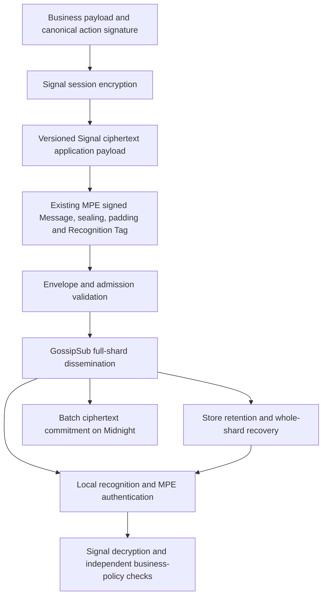

# GossipSub + Signal: feasible composition for consideration

**Recommendation: proceed with a backend, single-device, one-to-one experiment.** GossipSub can disseminate opaque envelopes, while Signal-family session cryptography protects their application payloads. Midnight Express remains responsible for recipient recognition, admission, retention, recovery, invitations and Midnight-verifiable business authorization. This is a feasibility recommendation, not an implemented protocol or production assurance.

Three independent agents studied **both components** before this option was added: [architecture](../../reviews/competitive-event-systems/gossipsub-signal/architecture.md), [privacy](../../reviews/competitive-event-systems/gossipsub-signal/privacy.md), [product](../../reviews/competitive-event-systems/gossipsub-signal/product.md), and [coverage](../../reviews/competitive-event-systems/gossipsub-signal/coverage.json). Primary-source text and hashes are in the [Scrapling catalog](../../catalog/event-systems/README.md).

## What each layer supplies

| Layer | Useful role | Still required from Midnight Express |
|---|---|---|
| GossipSub | Mesh dissemination, gossip repair, peer scoring and duplicate suppression | Admission proofs, wire bounds, expiry, retained backfill, private recognition, operator model and application delivery semantics |
| Signal-family protocols | Asynchronous key establishment, session encryption, per-message keys and ratchet lifecycle | Wallet/device identity binding, private bootstrap/discovery, durable state, group policy, separate business authority and backup policy |
| Midnight Express | Fixed-size sealed envelopes, local recognition, store/anchor integration and business messaging APIs | Measured composition, privacy invariants, actual proofs and deployment acceptance checks |

GossipSub 1.2 adds `IDONTWANT`; it does not establish persistent delivery or application authority. Control traffic must depend on opaque byte receipt/inventory rather than successful private recognition. Preserve the chosen anonymous outer pubsub profile: publisher signatures remain inside MPE sealing. Ingress still observes connections, and mesh peers observe shard membership. [GossipSub 1.2](https://github.com/libp2p/specs/blob/master/pubsub/gossipsub/gossipsub-v1.2.md), [1.1](https://github.com/libp2p/specs/blob/master/pubsub/gossipsub/gossipsub-v1.1.md), existing `MPE-FMT-012`.

Signal's published PQXDH addresses asynchronous session establishment; Double Ratchet supplies per-message keys and conditional compromise recovery; Sesame addresses asynchronous multi-device session management. The current ratchet specification also describes Sparse Post-Quantum Ratchet and Triple Ratchet. A PQ bootstrap plus a classical ratchet is a different security profile from continuous post-quantum ratcheting. Select and pin the exact algorithm/library version; do not claim that all of Signal's current security properties are inherited. [PQXDH](https://signal.org/docs/specifications/pqxdh/), [Double Ratchet](https://signal.org/docs/specifications/doubleratchet/), [Sesame](https://signal.org/docs/specifications/sesame/).

## Proposed first composition

Use a registered, versioned application schema containing serialized Signal ciphertext **inside the existing MPE Message and sealing profile**. This isolates the first experiment from changes to the transport and existing cryptographic wire suite. Its actual byte footprint must fit an existing size class; no automatic fragmentation or larger envelope is assumed.

This is our integration proposal, not a protocol already specified by Signal. It can use locally generated identities and authenticated invitations without Signal accounts, phone-number identifiers or Signal Messenger's servers. It does not provide interoperability with the Signal app. Signal's specifications separate reusable cryptographic ideas from deployment infrastructure. [Signal technical documentation](https://signal.org/docs/), [three-agent product assessment](../../reviews/competitive-event-systems/gossipsub-signal/product.md).

For the pilot, exchange authenticated device/prekey material through the invitation channel. A general prekey directory is a later component with identity verification, allocation, revocation and lookup-privacy requirements. Do not copy per-recipient service mailboxes into the strongest private-reception mode.

## Business authority and contract binding

There are two distinct signed objects in the proposed nested profile:

1. The ordinary MPE publisher statement authenticates its payload: the serialized Signal ciphertext container.
2. An inner canonical business instruction binds the actual effect inputs, recipient/target, chain/domain, logical identity, action and expiry to an authorized business key.

Signal pairwise session authentication does not replace a transferable signed instruction or the target contract's authorization policy. Group Sender Key messages have their own ciphertext signatures, but these do not automatically establish role-scoped Midnight business authority. Adding explicit business signatures also changes any deniability claim. [PQXDH security considerations](https://signal.org/docs/specifications/pqxdh/), [libsignal group implementation](https://github.com/signalapp/libsignal/blob/main/rust/protocol/src/group_cipher.rs).

Existing `MPE-CON-043`, `MPE-CON-044a/b` and `MPE-CON-060` remain required. A proof of inclusion of the outer envelope does **not** prove that a claimed plaintext instruction was inside its nested Signal ciphertext. Binding that relation may require additional cryptographic proof work and circuit cost; a recipient's successful decryption is not a substitute. The first pilot therefore demonstrates **off-chain coordination**. Contract consumption of the nested profile is separately gated on an implemented, measured binding design. The original contract-consumable MPE profile remains a separate option; it must not be relabeled as Signal-secured without implementing that composition. [Consolidated requirements](../design-document/build/ears-consolidated.json), [architecture assessment](../../reviews/competitive-event-systems/gossipsub-signal/architecture.md).

## Security and operational decisions

| Decision | Proposed first experiment | Boundary or deferred work |
|---|---|---|
| Recipient discovery | Existing whole-shard reception and local salted recognition | No public topic/session/device address; Signal does not make directory lookup private |
| Ratchet headers | Entire serialized Signal packet inside existing MPE sealing | Published encrypted-header ratchet variant is not proof that the chosen library exposes that API |
| Identity | One pinned wallet-authorized installation per party | Key substitution, replacement, revocation and authenticated first contact need explicit policy |
| Offline recovery | Existing bounded retention plus durable local ratchet state | Skipped-key bounds can make retained ciphertext unreadable; report key/history gaps |
| Crash safety | Atomically persist session changes and outgoing ciphertext/outbox | Test crashes and rollback; do not reuse session state, one-time prekeys or message keys |
| Compromise | Test inner content-key erasure and fresh updates | A stolen stable outer/recognition secret may match historical and future messages of that generation; inner ratcheting does not heal this metadata exposure |
| Groups | Pairwise fanout only in the first experiment | Count device/recipient copies against quotas; group Sender Keys and MLS are distinct mechanisms requiring separate decisions |
| Archives | Document precisely which keys remain recoverable | Restoring erased keys from backup undermines forward secrecy; retention is not deletion from prior readers |
| Library adoption | Pinned adapter with ownership of version upgrades | Actual API support, serialization compatibility, license/distribution and long-term maintenance remain gates |

Signal's upstream `libsignal` uses Rust with Java, Swift and TypeScript bindings, but explicitly does not support outside use and warns that APIs may change. Its repository is licensed under GNU AGPLv3, while this repository is Apache-2.0. Dependency and distribution choices require a deliberate assessment; this document makes no conclusion that the combination is automatically prohibited or that a process wrapper removes obligations. Prefer a maintained, reviewed implementation strategy over copying cryptographic code or inventing a ratchet. [libsignal README](https://github.com/signalapp/libsignal), [license](https://github.com/signalapp/libsignal/blob/main/LICENSE).

## Proposed acceptance gates

No gate has been executed. These are experiment requirements for a future implementation decision.

1. **Transport:** demonstrate negotiated GossipSub 1.2 with agreed scoring, malformed-proof limits, loss, duplicates and recovery. Inspect actual default/custom protocol configuration in the pinned crate.
2. **Bootstrap:** reject altered wallet/device identities and prekeys; test initialization replay, one-time-prekey races and expiry. Record any directory-lookup leakage.
3. **Wire fit:** measure initial, ordinary and ratchet-update packet sizes including both signatures, wrappers and padding; oversized messages return a defined refusal rather than changing the wire profile.
4. **Durability:** inject crashes around session update, outbox commit, publish, decrypt and application commit; demonstrate no key reuse, silent skip or duplicate local effect.
5. **Privacy:** swap recognized interests under the same scheduled workload; inspect pubsub controls, backfill, confirmation queries, telemetry and replies for recognition-dependent behavior. No automatic receipts or blob fetches.
6. **Compromise:** test erased past inner keys and recovery after fresh honest updates; report remaining outer-recognition/header exposure. Do not extend pairwise recovery claims to Sender Key groups.
7. **Business policy:** reject forged, wrong-target, expired and replayed inner instructions independently of session decryption.
8. **Contract consumption:** for any later nested on-chain action, reject a valid instruction paired with another envelope/inclusion path; measure actual proof generation and verification with every consumed field bound.
9. **Integration viability:** pin the dependency and record supported API/suite, license/distribution disposition, maintenance owner and migration/backup policy.

Go forward with the off-chain experiment if gates 1–7 and 9 can be met under the chosen profile. Gate 8 is mandatory before marketing or implementing nested-profile contract authorization. Groups, multi-device management, broad mobile delivery and production service targets remain separate scope decisions. The first applicable product use cases are [RFQ coordination, invoice workflows and delegated agent approval](top-ten-use-cases.md).
