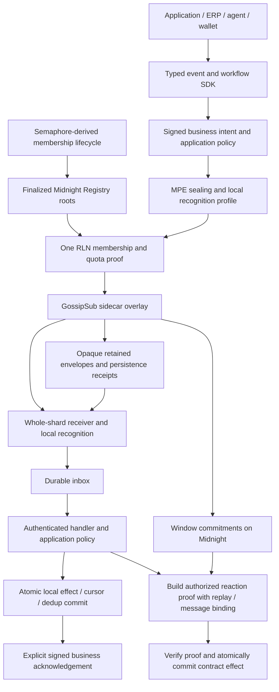

# Recommended stack and business workflows

## Product and audience

Midnight Express is proposed infrastructure for exchanging confidential business updates between applications. It addresses work that crosses organizational boundaries: a buyer requests a quote, a finance team matches a payment, or an agent asks a person to approve a purchase. Each participant needs a reliable record of the current terms and the authority to act on them.

The proposed network carries signed, encrypted events. Recipients recognize relevant messages locally, so delivery operators do not need their business subscription filters. Applications check permissions and retain processing state to recover after interruptions. Midnight supplies finalized membership and batch inclusion evidence; an action that changes a contract requires an additional proof of authority, message binding and replay protection. Connections, shard participation, timing and message sizes may remain visible under the selected profile.

Start with **backend/desktop institutional RFQ coordination**, reuse that foundation for **invoice reconciliation and human-approved agent workflows**, and measure those pilots against customers' current processes. The pilots would test whether this approach reduces staff handoffs and reconciliation effort. Demand, savings and operator economics remain unvalidated. The repository contains design work and bounded local reference implementations; production protocol integration remains proposed.

## Selected stack

| Layer | Recommendation | Why / boundary |
|---|---|---|
| Core and transport | **Rust + rust-libp2p GossipSub v1.2 profile** | Reuse the original sidecar architecture. Configure anonymous message fields, validation and peer scoring; finish application-expiry checks on cached/queued sends. No business topics or content-aware routing in the default private profile. |
| Wire and recognition | **Original MPE fixed classes, AEAD, signatures and salted local recognition** | Preserve byte compatibility and whole-shard reception. Source/type/correlation/role data stays inside authenticated encryption. Static launch streams do not claim forward secrecy or ingress anonymity. |
| Membership lifecycle | **Semaphore-derived identity, commitment and witness APIs** | Reuse independent admission identities, insertion/removal witnesses and disciplined scope/nullifier handling. Midnight finalized Registry roots remain authoritative. Runtime library reuse depends on exact commitment/hash/field/tree compatibility. |
| Anonymous admission | **One RLN-style proof; Zerokit as the preferred evaluation engine** | Prove membership, committed per-class credit bounds and content-bound abuse evidence together. Adapt to Midnight and benchmark before dependency acceptance. Do not add a second Semaphore proof per event. |
| Session/group security | **OpenMLS as the selected extension** | The portfolio is mainly organizational and group-oriented. Validate its two-member and larger-group profile within MPE rather than maintain separate Signal and MLS state systems. First coordination pilot retains the original symmetric profile; OpenMLS deployment waits for identity, metadata, wire-fit, rekey and crash/erasure tests. |
| Durable recovery | **UmbraDB + PostgreSQL for trusted backend workflow hosts; SQLite for standalone Rust nodes/clients** | Reuse Midnight temporal records, checkpoints and watermarks. Add an MPE future-release capability for atomic effects/dedup/outbox/checkpoint/cursor, strict durability and protected restore. UmbraDB is Node >=24, single-writer, not an in-process Rust engine. Replicated opaque envelopes still use the custom MPE store protocol; database selection does not implement retention receipts or replication. |
| Ledger and authorization | **Custom Midnight Registry, Anchor, ledger and consumer adapters** | Enforce finalized membership state, exact carried-event bytes/applied phase, signed business authority, replay nullifiers and anchored-message binding. Transport encryption or inclusion proofs alone cannot authorize an effect. |
| Event contract and SDK | **Structured CloudEvents-compatible payloads inside encryption; AsyncAPI contracts; Rust core with TypeScript-facing SDK** | Familiar event identity/source/type/schema and cancellable listeners. Expose bounded async processing, failures, gaps, expiry and recovery without recognition-triggered upstream selectors or automatic acknowledgements. |
| Enterprise/chain integration | **Explicit application-owned adapters** | Map source identity, version, snapshot/delta and finality. First adapters serve RFQ applications, ERP/payment status and bounded agent approvals. Connector evidence authenticates source claims; application policy authorizes effects. |
| Operations | **Privacy-preserving health metrics and encrypted local quarantine** | Distinguish admission, persistence, anchoring/finality, processing and business completion. Budget retries, preserve message identity/expiry, authorize redrive and fund storage/relay operators before production. |

These selections are architectural judgments based on the [comparative event-systems research](../../reviews/competitive-event-systems/extraction.md), [original requirement fit](requirements-fit-and-open-source.md), [Semaphore study](semaphore-membership-option.md) and [UmbraDB recovery study](umbradb-recovery.md), not evidence of integration acceptance. Primary implementations: [rust-libp2p](https://github.com/libp2p/rust-libp2p), [Zerokit](https://github.com/vacp2p/zerokit), [OpenMLS](https://github.com/openmls/openmls), [Semaphore](https://github.com/semaphore-protocol/semaphore), [SQLite](https://www.sqlite.org/atomiccommit.html). Event contracts: [CloudEvents](https://cloudevents.io/) and [AsyncAPI](https://www.asyncapi.com/docs/concepts/asyncapi-document).

### How the layers compose

The durable inbox/commit layer runs inside each application endpoint’s trust domain: UmbraDB/Postgres for the Node backend host, SQLite for a standalone Rust node/client. Transport operators do not inherit plaintext or keys.

A normal notification or coordination message does not need a contract effect or per-message ledger transaction. Anchor inclusion, retention and business acknowledgement are separate evidence. OpenMLS supplies optional session security inside the selected MPE composition; it does not replace recognition or authorize contracts.

## What we retain from the comparative research

- **Kafka/NATS:** durable progress, bounded demand, replay horizons and destination-aware idempotency.
- **RabbitMQ/EventBridge:** separate confirmation meanings, bounded retry age, encrypted quarantine and authorized redrive.
- **CloudEvents/AsyncAPI/Node/DOM:** versioned private event schemas, documented operations, `on`/`off`/`once`, cancellation and isolated handlers. `once` means listener behavior, not once-only business execution.
- **Ethereum/Solana/NEAR/Hyperliquid:** deterministic source identity, provisional/retracted/final states, catch-up and snapshot/delta freshness. Public RPC filters do not provide private reception.
- **XMTP/Sui:** membership updates, installation/role identity, rekeying and explicit history policy. Remove members from future epochs without claiming deletion of past plaintext.
- **Waku/Semaphore:** modular relay/store roles, genuine anonymous admission and maintainable identity/witness lifecycle. Preserve a single authoritative membership profile.

These studies inform the delivery and application rules. They do not require deploying Kafka, NATS, Signal or every studied blockchain alongside MPE.

## Ranked use cases against this stack

Ranking balances confidentiality value, common stack reuse, measurable pilot outcomes and additional dependency burden. UC identifiers are stable; this ordering supersedes the earlier exploratory rank. The selected metrics are evaluation measures, not service commitments.

| Rank / ID | Use case | Business value hypothesis | First useful scope and stack fit | Principal remaining gate |
|---|---|---|---|---|
| 1 / UC-01 | **Institutional RFQ and quote coordination** | Protect commercial intent; shorten quote and reconciliation handoffs | Requests, signed offers, expiry and off-chain acceptance using schemas, roles and recovery | Settlement needs proven authority/replay/anchored binding |
| 2 / UC-03 | **Invoice and payment-status reconciliation** | Reduce manual matching and duplicate postings | Signed invoice/payment notices, ERP adapter, durable inbox and checkpoints | Authenticated payment evidence and destination idempotency |
| 3 / UC-05 | **Agent coordination and human approval** | Automate bounded work with accountable approvals | Signed proposals, expiring human approvals and sandboxed target/budget enforcement | Application capability enforcement; separate proof gate for contract effects |
| 4 / UC-06 | **Credential/access-revocation updates** | Reduce stale access decisions and issuer administration | Authenticated issuer epochs, verifier freshness and removal/rekey lifecycle | Issuer authority, cache policy and measured rekey/enforcement completion |
| 5 / UC-07 | **Procurement/supply-chain exceptions** | Resolve delays and disputes with fewer repeated requests | Restricted milestones and exception notices through role-based partner adapters | Gateway provenance, partner integration and long-history policy |
| 6 / UC-02 | **Private contract lifecycle notifications** | Improve application status and reduce missed-event support work | Backend/desktop adapter and finality-aware listeners; signed application/public events can pilot first | Private carried-event capability and exact applied-phase checks; mobile separate |
| 7 / UC-10 | **Incident/cross-chain operations coordination** | Improve response handoffs while protecting incident details | Isolated handlers, encrypted quarantine, trusted-source adapters and scoped response proposals | Declared connector trust, funded operators and independent emergency channel |
| 8 / UC-09 | **Governance review and approval** | Shorten confidential review and evidence preparation | Group roles, explicit approvals and selective audit disclosure | Threshold authority; consumer proof before on-chain execution |
| 9 / UC-04 | **Portfolio/collateral risk alerts** | Enable earlier informed intervention without sharing watchlists with brokers | Advisory backend alerts, snapshot/delta recovery and stale/gap status | Reliable market sources; no hard-real-time guarantee; private mobile retrieval |
| 10 / UC-08 | **Insurance claim handoffs** | Reduce redundant evidence requests and processing delays | Milestone events and explicitly authorized encrypted-document references | Sector/customer handling policy, object storage integration and long-lived history |

The [use-case register](use-cases.json) and [detailed product requirements](top-ten-use-cases.md) map every selection to existing obligations, candidate extensions, acceptance scenarios, stack dependencies and pilot measures. Agent approval ranks third because it can exercise the same SDK and signed-policy machinery in a controlled backend pilot; procurement follows once partner connectors are ready.

## Delivery order and acceptance gates

- **RFQ coordination demonstration.** Existing envelopes, listener SDK, authenticated role invitations, UmbraDB/Postgres recovery in the trusted Node workflow host (SQLite for standalone Rust) and a quote state machine. Use clearly labeled mocked Registry/admission only for an internal demonstration. Measure quote turnaround, manual handoffs, crash recovery, expiry and duplicate handling. No automatic settlement claim.
- **Reusable coordination pilot.** Validate invoice reconciliation and bounded human-approved agent workflows. Keep external effects idempotent/reconciled, cancellation local, semantic headers encrypted and failure isolation tested. Obtain customer baselines before setting targets.
- **Production coordination core and group extension.** Real Midnight registration/finalized roots, genuine RLN relation, actual slot/verification measurements, durable replicated retention, signed persistence receipts, funded operators and independent security evidence. Backend recovery requires the proposed UmbraDB MPE capability or equivalently verified caller composition; current `saveAndAdvance` covers checkpoint/cursor only. Add OpenMLS only after its separate credential/epoch/rekey/wire/recovery gates; initial pilot success does not establish these gates.
- **Authorized ledger effects and private carried events.** Complete signed authority, atomic replay protection and CON-060 anchored-message binding before settlement. Exact carried-event/applied-phase checks and underlying private-event support gate contract-origin notifications. These tracks can proceed alongside coordination work but are required before their respective product promises.
- **Private mobile reception.** Separate PIR/OMR private discovery/retrieval experiment with complete bandwidth, energy, authenticity and access-pattern measurements. No filtered webhooks or generic push workaround inherits the strongest privacy claim.

Do not put Signal in the first dependency set alongside OpenMLS. Keep Signal as a documented alternative if customer evidence favors a dedicated pairwise product. Tor/Arti is an optional later origin-privacy profile; PIR engines are research candidates. RocksDB and additional chain/ERP connectors follow measured workload or customer needs.

The selected libraries still need to be integrated with the custom MPE admission profile, store protocol, SDK privacy rules and Midnight authority/binding circuits. The original PDF/register remains authoritative for protocol requirements.

## Consumer integration

The [private subscription design](pubsub-subscription-experience.md) adds a principal-bound local watch service, typed SDK and durable consumer journal above whole-shard recognition. Umbra/PostgreSQL or SQLite supplies the selected host's state tier; the consumer transaction and recovery semantics still need implementation. Optional versioned MCP, A2A and AG-UI adapters serve agent interfaces. Moth is a wallet connector, not membership or business authority. The [browser proof of concept](../../website/dist/subscriptions.html) demonstrates local mock delivery and explicit Moth connection controls; it does not run the protocol or persist state.
