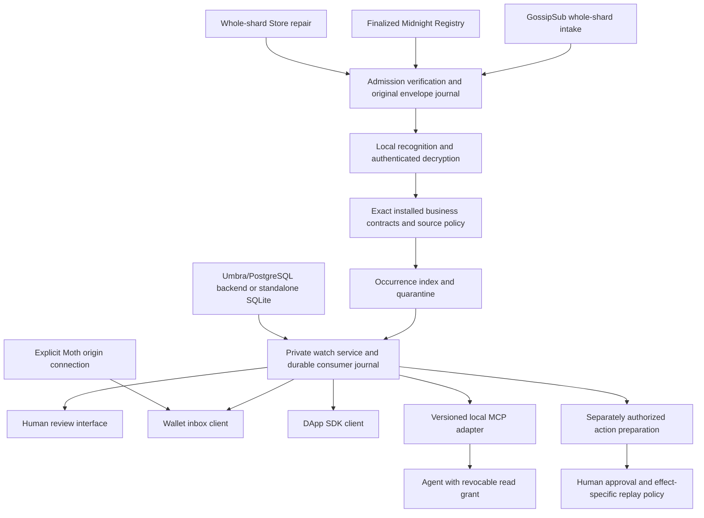

# Subscription architecture and convergence

Midnight Express should keep subscriptions in a private local watch service, backed by a durable consumer journal. Humans, wallets, DApps and agents read that service through scoped interfaces. The existing GossipSub and local recognition design remains the transport foundation; this work selects no additional mandatory network broker or pub/sub protocol.

This is the reconciled design from the requested researcher reports. Agreement is recorded by subject, with objections retained below. It is not a unanimous vote or evidence that the complete protocol has been implemented. [Progress notes](progress.md), [provider provenance](surge.json) and [source index](source-index.json) preserve the investigation.

## How the components fit

Transport admission, recognition access, business source authentication, local consumer permission and effect authority remain separate checks. Wallet connection supplies none of the other checks. Selectors, watch handles, cursors and processing dispositions stay local. Whole-shard participation remains visible to peers, and authorized shard readers can see the shard's decryptable content.

## Selected design

| Concern | Decision | Implementation boundary |
|---|---|---|
| Human subscription | Browse meaningful categories and examples, choose local scope, expose permission and coverage, review explicitly. | Categories are navigation labels. Suggested personas in the demo are not separate authenticated principals. Production wording and consent need user testing. |
| Consumer control plane | Closed local intent with exact contract commitment, principal, sink, expiry, start and immutable revision. | [Proposed schema](../../design/subscriptions/README.md) checks structure. Runtime grant resolution, CAS and cursor ownership remain to build. |
| Durable progress | Single-writer journal with host high-water, delivered cursor, contiguous processing cursor, quarantine and separate action ledger. | Umbra/PostgreSQL backend and SQLite standalone remain selected. Browser memory does not establish persistence or effect atomicity. |
| Backpressure | Bound local pull credit, event count and bytes; retain originals and expose explicit gaps. | Consumer demand never changes recognition-dependent network timing. Whole-shard intake and repair policy remain independent of matches. |
| Recovery | Recover retained originals with stable occurrence identity; unavailable history requires explicit gap acceptance or authorized whole-shard archive repair. | Delivery and processing receipts stay local. Uncertain effects require reconciliation, not a silent retry. |
| Agent interface | Local bounded pull over a human-provisioned revocable grant, optional MCP invalidation hints. | Sender text is untrusted. Tools, grant widening, wallet access and consequential approval remain separate. Host scheduling is not guaranteed by MCP. |
| Interoperability | Version-pinned MCP adapter; optional A2A tasks, MCP Apps or AG-UI supervision. | The standards inventory is a survey, not exhaustive implementation. No public private-watch directory, automatic webhook or new admission registry. |
| Data contract | Keep v0.2 RFQ, invoice-observation and sandbox-approval profiles closed. | Actual fixed-context checks retain `executes:false`. Contract/credential categories remain unsigned mocks; chain catalogs do not become runtime types. |
| Moth | Exact verified 4.0.1 provider at wallet commit d48206a, explicit connect/status only, no polling. | Grant is origin-wide. Pages acknowledgement names the shared origin. Dedicated origin and real-extension acceptance are production gates. |
| Additional technology | Build the local service, SDK, durable journal composition and adapters. | No NATS/Kafka/CESQL/CloudEvents subscription manager dependency is selected. Store protocol, admission compatibility and full wire integration still need work. |

## Evidence and disagreements by reviewer

| Report | Finding adopted or resolved |
|---|---|
| [GPT agent standards](agents/sol-agent-standards.md) | Current MCP is distinct from legacy subscription/session interfaces; durable local state sits below adapters. |
| [GPT wallet consumers](agents/sol-wallet-consumers.md) | Exact Moth namespace/version/calls; corrected initial business-topic routing into local selection. |
| [GPT subscription contracts](agents/sol-subscription-contracts.md) | Closed control-plane contract and actual model-fit validation, separate from sealed business events. |
| [GPT dashboard](agents/sol-pubsub-dashboard.md) | Implemented bounded simulation; review found and fixed lifecycle, pause, replay and rejected-input bookkeeping defects. |
| [Opus human experience](agents/opus-human-experience.md) | Separate received coverage from matched/reviewed progress. Keep remote push optional and disclose gaps. Production terminology remains a user-test question. |
| [Opus agent experience](agents/opus-agent-experience.md) | Private caches, per-request grants, untrusted text isolation and host-controlled prompts; evaluate MCP Apps for in-host supervision. Adapter language and actual host support remain open. |
| [Opus privacy authority](agents/opus-privacy-authority.md) | Match-independent intake, sensitive local selectors, no wallet-derived recognition keys, shared-origin warning and explicit acknowledgement. |
| [Opus stack feasibility](agents/opus-stack-feasibility.md) | No third network pub/sub protocol; build endpoint services. Recognition cost, RLN compatibility, sealed sizes and Store repair remain gates. |
| [Grok data utility](agents/grok-data-utility.md) | Exact profile/predicate intersection, validation before selection, Final as an assertion. CloudEvents Subscriptions API is a separate draft; do not adopt a manager or CESQL. |
| [Grok recovery lifecycle](agents/grok-recovery-lifecycle.md) | Distinct cursor/disposition/effect identities, conservative uncertain outcomes, and host high-water. Borrow demand and durable pull patterns without importing a broker. |
| [Grok demo product](agents/grok-demo-product.md) | Readable workflow examples and suggested consumer journeys; exact wallet grant exposure. Several reported UI defects were already corrected during concurrent review. |
| [Grok independent critic](agents/grok-adversarial-consensus.md) | Separate protocol labels, release commits, moving docs and package versions. Resolve names from actual schema context instead of string counts. |

## Version reconciliation

MCP's docs identify 2026-07-28 as current and allow compatible changes under that date. The release tag is commit `5f5440bb26a62e2cf3440b92da5a667efa03b267`; captured main was `75db1e987cbbba6d170315dc99d0dfc440754aef`. Adapter acceptance must pin both protocol label and implementation artifact. The critic found `resources/subscribe` in the tag schema but did not classify it. Coordinator inspection of archived schema lines 1283–1287 resolves it: the occurrence is a comment saying the new resource subscription filter replaces the former RPC. It does not establish a surviving current RPC. Independent GPT/Opus changelog and subscription captures support the current adapter design.

A2A's captured latest-site banner says 1.0.0; its latest non-prerelease GitHub release is v1.0.1 at `3303592588e388e62e0f69f701af531d2f4e3991`. The captured specification requires major.minor `1.0` on the wire. Optional adapter work must pin its source commit and test behavior; a patch release label is not the request version.

Moth reports API 4.0.1 at wallet commit `d48206a1957af09bf17bf5e941c2b5bccb12db63`. The upstream connector beta.1 release is `da90f631d45338d640365fb3d868e095130b4d6d`; captured connector main `612db2b62dbd78c079da62e57e7b8585a204b858` carries the same package version after further commits. The demo accepts the verified Moth interface, not either beta tree. Archived Moth handler lines 255–264 confirm connect rejects a requested network different from wallet settings. That check is separate from origin grants, whose `isAllowed` does not enforce stored network or method scope.

CloudEvents 1.0.2 core and its current main are separate artifacts. The separate Subscriptions API is 0.1-wip at the reviewed commit. AsyncAPI 3.0 was the initial survey source; Grok additionally fetched release 3.1.0. Defer a production AsyncAPI artifact until the local contract is accepted. Living standards retain retrieval times and snapshot hashes rather than an invented release version.

## Objections retained

The private profile's whole-shard cost remains a mobile and high-volume constraint. A remote selector gateway could help resource-limited clients, but exposes interests and requires an explicit weaker profile. It is not a fallback.

Opus privacy preferred a dedicated wallet origin or explicit acknowledgement on Pages. This demonstration chooses acknowledgement; it does not narrow Moth's grant. Production should use a dedicated origin. No signing, proving or submission method is called by the adapter.

Agent watch creation is human-provisioned by default. Later delegated creation could be allowed within a grant that cannot widen scope, but it needs its own proof and tests. The preferred SDK language for an MCP adapter remains open; the core architecture keeps Rust with a TypeScript-facing application client.

Invoice and approval fixtures have less independent interpretation evidence than the RFQ campaign. They are useful single-implementation demonstration contracts, not partner-ready universal standards. Payment rows identify distinct observations and payment IDs; the screen must not infer an invoice is paid or that a pending row evolved into a different payment's Final row.

Human terminology, per-source display preferences, alert policies and offline review conflicts need product testing. The current dashboard is an engineering interaction reference. It shows mock host high-water and local cursor positions without claiming complete transport coverage.

## Delivered and still required

Delivered: the website subscription simulation, bounded Moth adapter, exact public offline fixture receipts, permanent behavioral checks, proposed closed local schema, research corpus and updated product/stack/design documentation. [Requirements](../../docs/product-requirements/pubsub-subscription-experience.md) list the integration gates.

Still required: real transport and sealed-wire integration, authenticated local grants and business sources, durable consumer transactions and crash tests, actual Store repair, current finality/admission evidence, measured recognition and wire budgets, real host/extension interoperability and customer workflow baselines. None is supplied by a working static interface or Lean data-model properties.
